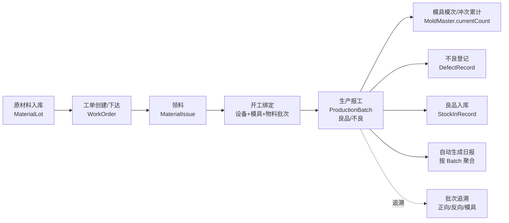

# PROJECT_INDEX.md — 泰国工厂轻量MES 项目地图（L1 根索引）

> 用途：新会话/新 Agent 冷启动时快速建立全局认知，回答"页面 → Server Action/API → lib → 数据模型"。
> 维护策略：**不做严格同步**，大的架构/模块变更时手动刷新一次。过期时以真实代码为准。
> 生成于 2026-07-12（项目初始化时），基于王老师提供的 SPEC v0.1。规则见 `CLAUDE.md`（本文件不重复）。

---

## 1. 项目一句话

泰国工厂汽车电子结构件（注塑+冲压，线束预留）轻量 MES 一期 Demo：工单驱动生产，批次支撑追溯，模具关联寿命，日报自动汇总。当前状态：**核心功能已部署到阿里云 MySQL 测试环境，HTTP/数据库一致性验证通过**。

## 2. 技术栈

| 层 | 选型 |
|----|------|
| 前端/后端 | Next.js 14.2（App Router，前后端同仓） |
| UI | Ant Design 5 + React 18 |
| ORM/DB | Prisma 6 + SQLite（本地开发）/ MySQL（测试环境，部署前需切换 provider，见 CLAUDE.md） |
| 语言 | TypeScript |

版本选型理由：均为"降一档"稳定线（避开 Next 15/16、React 19、antd 6、Prisma 7 的生态适配坑），详见 `CLAUDE.md`。

部署：阿里云 `http://8.130.182.148/taiguo-mes/dashboard`，见 `docs/SHIP-PROFILE.md`。

## 3. 核心业务主链路



关键不变量（详见 `docs/PRD.md` 及 SPEC v0.1 §8）：
- **小批次追溯**：换 SKU/工单/班次/设备/模具/原材料批次 = 拆新生产批次，追溯粒度到批次不到单件
- **批次号规则固定**：`{INJ|STP}-{YYYYMMDD}-{D|N}-{设备编号}-{流水号3位}`，实现只此一处（`src/lib/batch-no.ts`）
- **数量闭环**：总生产=良品+不良；实际消耗=领料-退料；入库数量≤良品数量
- **模具状态机**：维修中/停用/报废禁止开工；寿命使用率≥100% 需二次确认

## 4. 目录结构（只列施工常去处，随开发落地逐步补全）

```
src/
├── app/                     # 主业务页面，按 SPEC 模块分目录（无路由组，页面即顶层路由）
│   ├── dashboard/           # 仪表盘 F009
│   ├── work-orders/         # 生产工单 F002
│   ├── injection/           # 注塑报工 F003
│   ├── stamping/            # 冲压报工 F004
│   ├── materials/           # 物料批次 F005
│   ├── molds/                # 模具台账 F006
│   ├── trace/                # 批次追溯 F007
│   ├── report/                # 生产日报 F008
│   ├── master-data/          # 基础数据只读 F001
│   ├── page.tsx              # 根路径重定向到 /dashboard
│   ├── layout.tsx            # 全局布局（AntdRegistry + ConfigProvider + AppShell 侧边栏）
│   └── theme.ts              # antd 主题 token（工业风：石墨侧边栏+橙色主色+语义状态色）
├── components/
│   ├── layout/AppShell.tsx   # 侧边栏导航 + 顶栏（客户端组件）
│   ├── charts/                # TrendChart（柱/线）/ RankedBarList，纯 SVG 无第三方图表库
│   ├── dashboard/  work-orders/  production/  materials/  molds/  trace/  report/  master-data/
│   │                          # 各业务域的客户端组件（antd Table 等必须在这层，见下方 RSC 边界铁律）
│   ├── StatusTag.tsx  MoldLifeMeter.tsx
├── lib/
│   ├── batch-no.ts          # ⭐ 批次号生成规则，唯一实现
│   ├── production-calc.ts   # ⭐ 数量闭环/材料利用率/冲次/模具寿命公式，唯一实现
│   ├── constants.ts         # 状态字段取值范围字典（替代 Prisma enum）
│   ├── date-utils.ts        # 曼谷时区(+07:00)按天分组，禁止直接用 toISOString().slice(0,10)
│   ├── db.ts                # PrismaClient 单例
│   ├── queries/              # 服务端数据查询（Server Component 直接 await 调用）
│   └── actions/              # Server Actions（'use server'，按业务域分文件）
prisma/
├── schema.prisma            # 数据模型唯一权威
└── seed.ts                  # 演示数据（锚定固定日期 2026-07-12，见 CLAUDE.md）
docs/                        # PRD.md / SHIP-PROFILE.md / _INDEX.md
```

**RSC 边界铁律（build 阶段才会暴露，tsc 抓不到）**：任何 `page.tsx`（Server Component）不能直接渲染带 `render` 函数的 antd `<Table columns={...}>`——函数无法跨 Server→Client 边界序列化。凡是要用 antd Table/Form 等交互组件，必须封装成独立的 `"use client"` 组件再从 page.tsx 传参调用（本项目已踩过一次坑：dashboard 页面和 RecentBatchesTable 曾直接内联，`npm run build` 报 "Functions cannot be passed directly to Client Components"，已修复）。

## 5. 功能域地图（页面 ↔ 数据模型对照，随开发补全）

| 业务域 | 页面 | 核心数据模型 | 说明 |
|--------|------|--------------|------|
| 仪表盘 | `dashboard` | 聚合 ProductionBatch/DefectRecord/MoldMaster | 只读，无独立表 |
| 工单 | `work-orders` | WorkOrder | 状态机：未下达→已下达→生产中→暂停/已完工→已关闭 |
| 注塑报工 | `injection` | ProductionBatch(type=注塑) | 开工+报工两段式表单 |
| 冲压报工 | `stamping` | ProductionBatch(type=冲压) | 开工+报工两段式表单 |
| 物料批次 | `materials` | MaterialLot/MaterialIssue/MaterialReturn/StockInRecord | 4 个 tab |
| 模具台账 | `molds` | MoldMaster/MoldMaintenanceRecord | 寿命进度条+保养表单 |
| 批次追溯 | `trace` | 跨表查询，无独立表 | 3 个 tab：正向/反向/模具 |
| 生产日报 | `report` | 聚合 ProductionBatch 等 | 8 维度可切换聚合 |
| 基础数据 | `master-data` | ProductSku/MaterialMaster/EquipmentMaster | 只读字典展示 |

## 6. 文档指针

- `docs/PRD.md` — 需求与功能状态
- `docs/SHIP-PROFILE.md` — 发版档案
- `docs/_INDEX.md` — docs 目录索引
